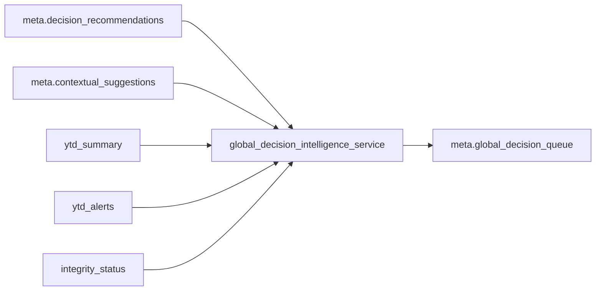

# FASE 4.4 — Global Decision Intelligence Layer

## Contexto en código

- [`projection_decision_policy_engine.py`](c:\Users\Pc\Documents\Cursor Proyectos\YEGO CONTROL TOWER\backend\app\services\projection_decision_policy_engine.py) ya emite una recomendación **por** `entity` (string, p. ej. `"Lima - Delivery"`) con `decision_score`, `recommended_action`, `decision_factors`, `decision_constraints`, `policy_trace`, `contextual_suggestion_id`.
- [`projection_ytd_alerts_service.py`](c:\Users\Pc\Documents\Cursor Proyectos\YEGO CONTROL TOWER\backend\app\services\projection_ytd_alerts_service.py) construye alertas con `entity`, `country`, `city`, `business_slice` (LOB), `gap_trips`, `gap_pct`, `ytd_trend`, `pacing_vs_expected`, etc. La etiqueta `entity` en dimensión `lob` coincide con el patrón `ciudad - LOB`.
- [`projection_contextual_suggestion_service.py`](c:\Users\Pc\Documents\Cursor Proyectos\YEGO CONTROL TOWER\backend\app\services\projection_contextual_suggestion_service.py) enriquece cada ítem con `operational_leverage_score`, `estimated_recovery`, `contextual_reasoning`, `operational_pool.segments` **sin** exponer hoy un `source_alert` en el payload final; el enlace estable a fila contextual es `suggestion_id` = `contextual_suggestion_id` en la reco.

## Enfoque arquitectónico

- **Una sola responsabilidad**: ordenar y enriquecer entradas ya decididas por entidad; ningún recalculo de contextual, forecast ni recovery.
- **Lookup contextual**: índice `suggestion_id -> dict` a partir de la lista ya construida en [`projection_expected_progress_service.py`](c:\Users\Pc\Documents\Cursor Proyectos\YEGO CONTROL TOWER\backend\app\services\projection_expected_progress_service.py) (misma request). No se modifica el flujo interno del contextual service (no recalc).

## Archivo nuevo

**[`backend/app/services/global_decision_intelligence_service.py`](c:\Users\Pc\Documents\Cursor Proyectos\YEGO CONTROL TOWER\backend\app\services\global_decision_intelligence_service.py)**

API propuesta (alineada al spec):

- `build_global_decision_queue(...)` → `(queue: List[dict], check: str)` con `check in ("ok", "partial", "missing")`.
- `safe_build_global_decision_queue(...)` con try/except → `[], "missing"`.
- `merge_integrity_with_global_decision_check(integrity_status, check)` → añade `checks["global_decision_engine"]`.

### Entradas (solo lectura)

- `decision_recommendations`, `contextual_suggestions`, `ytd_summary`, `ytd_alerts`, `integrity_status`, `grain`, `filters` (año/mes/país ciudad LOB ya usados en Omniview).

### Reglas de salida

1. Si `integrity_status.status == "broken"` → `[]`, `missing`.
2. Si no hay `decision_recommendations` válidas (lista vacía o sin elementos útiles) → `[]`, `missing`.
3. **Dedup**: una fila global por `recommendation_id` / `entity` (misma clave que ya usa el motor local); ante duplicados imposibles, conservar la de mayor `decision_score`.
4. Ordenar por `global_decision_score` **DESC**; asignar `global_priority_rank` 1..n.

### Heurística V1 (pesos fijos documentados en `global_policy_trace`)

Por cada reco + ctx lookup + alert match:

| Dimensión | Fuente | Idea |
|-----------|--------|------|
| `local_decision_strength` | `decision_score` | Fuerza de la política local (0–100). |
| `business_impact_weight` | `ytd_alerts` (abs `gap_trips`, `gap_pct`), `ytd_summary` (escala portfolio tipo `ytd_real_trips` / `ytd_gap_trips` para normalizar), `operational_leverage_score`, `estimated_recovery` | Mayor peso operativo en slices con brecha y apalancamiento altos. |
| `urgency_weight` | `ytd_trend`, `pacing_vs_expected`, `gap_pct`, ancla de «tiempo restante» desde `ytd_summary.through_period` / `filters.month` | Deterioro + behind + menos tiempo → sube urgencia. |
| `reachability_impact_weight` | `estimated_recovery.potential_gap_recovery_pct`, `potential_trips_recovered_weekly` | Proxy de «cuánto cierra el gap» sin forecast nuevo. |
| `operational_feasibility_weight` | `decision_factors` (complejidad, velocidad implícita), `ACTION_CATALOG` por `action_type` (velocidad/costo) **import sólo del catálogo ya usado** | No editar suggestion engine: import read-only de `ACTION_CATALOG` desde [`projection_suggestion_engine_service.py`](c:\Users\Pc\Documents\Cursor Proyectos\YEGO CONTROL TOWER\backend\app\services\projection_suggestion_engine_service.py). |
| `strategic_weight` | Dict configurable en el propio servicio, p. ej. `STRATEGIC_WEIGHT_RULES`: claves normalizadas `country`, `city`, `lob` con multiplicadores por defecto 1.0; ejemplo documentado Perú / Lima / Auto regular | Extensible; normalización `lower/strip` sin hardcode rígido en lógica dispersa. |

**`global_decision_score`**: combinación lineal normalizada 0–100 de las dimensiones anteriores (pesos constantes + tope explícito si `data_confidence` / contextual `confidence` es `low` → penalización fuerte acorde al spec 4.3).

**`global_decision_reasoning`**: textos **no genéricoss** plantilla+datos (gap, tendencia, ciudad, acción, % recuperación) en español, campos `why_prioritized_globally`, `expected_business_impact`, `strategic_relevance`, `urgency_reasoning`, `execution_feasibility`.

**`decision_risks`**: incluir `operational_saturation_risk`, `execution_complexity_risk`, `confidence_risk` (strings auditables).

**`resource_profile`**: mapa heurístico `action_type` → `estimated_operational_load` + `required_team_type` (lista: outbound, field_supply, crm, etc.).

**`portfolio_role`**: clasificación por `action_type` (p. ej. reactivación → `quick_win`, scouts → `growth`, revisión ticket/pricing-like → `structural`, contención → `defensive`); `portfolio_balance_weight` numérico 0–100 derivado simple (p. ej. rol + penalización suave si ya hay muchas entradas del mismo rol en la cola).

**`global_policy_trace`**: `policy_version: "v1"`, `policy_type: "global_heuristic_priority_engine"`, `inputs_used` (lista de strings), `weights` (dict), `score_breakdown` (dict por ítem).

### Matching alerta ↔ reco

- Buscar en `ytd_alerts` la alerta cuyo `entity` coincide exactamente con `reco["entity"]`; si no hay, fallback: mismo `country`+`city`+`business_slice` si se parsea el label (último recurso: solo string `entity`).
- **Segmento** para `entity.segment`: del contextual lookup — primer segmento del pool con mayor masa (`drivers`) o `display_name`; si no hay, `"—"` o null documentado.

### Saturación (V1)

- Segunda pasada sobre la cola ordenada: contar `action_type` y tipos de equipo; si frecuencia &gt; umbral (p. ej. ≥3 mismas acciones), añadir texto en `operational_saturation_risk` y forzar `check` mínimo `partial` si hay «warning» de saturación visible.

### Integridad `checks.global_decision_engine`

- `missing`: broken, sin recos, cola vacía con recos válidas, scores NaN, item sin `global_policy_trace`.
- `partial`: confianza baja dominante, saturación, inputs incompletos (sin alert match + sin recovery).
- `ok`: resto.

## Integración aditiva (un solo archivo de orquestación tocado)

[`projection_expected_progress_service.py`](c:\Users\Pc\Documents\Cursor Proyectos\YEGO CONTROL TOWER\backend\app\services\projection_expected_progress_service.py):

- Tras `merge_integrity_with_decision_policy_check`, llamar `safe_build_global_decision_queue` con las listas ya en memoria.
- `merge_integrity_with_global_decision_check`.
- Añadir `"global_decision_queue": global_queue` en `meta` del retorno OK y en el payload de **early return** vacío (lista `[]` + check coherente).

**No** modificar: [`projection_suggestion_engine_service.py`](c:\Users\Pc\Documents\Cursor Proyectos\YEGO CONTROL TOWER\backend\app\services\projection_suggestion_engine_service.py), [`projection_decision_policy_engine.py`](c:\Users\Pc\Documents\Cursor Proyectos\YEGO CONTROL TOWER\backend\app\services\projection_decision_policy_engine.py), ni lógica interna de contextual (solo consumo).

## Frontend

[`BusinessSliceOmniviewMatrix.jsx`](c:\Users\Pc\Documents\Cursor Proyectos\YEGO CONTROL TOWER\frontend\src\components\BusinessSliceOmniviewMatrix.jsx):

- Nuevo componente `ProjectionGlobalStrategicQueueBlock` **debajo** de `ProjectionDecisionRecommendationsBlock`.
- Vista compacta: rank, entidad (país/ciudad/LOB/segmento resumidos), acción, `global_decision_score`, extracts de `why_prioritized_globally` / impacto / rol (badge).
- Aviso: «Global Decision Layer informativa — ejecución no habilitada»; botones deshabilitados.
- `
`: `global_policy_trace`, breakdown, riesgos, resource profile, dimensiones.
- Condición integridad rota / cola vacía + check `missing` similar al bloque de decision recommendations.

## Tests

Nuevo [`backend/tests/test_global_decision_intelligence_service.py`](c:\Users\Pc\Documents\Cursor Proyectos\YEGO CONTROL TOWER\backend\tests\test_global_decision_intelligence_service.py):

- Parametrizar `grain`: daily, weekly, monthly (parámetro inerte pero aceptado).
- Lima vs Trujillo: misma acción pero gap mayor en Lima + peso estratégico → Lima arriba.
- `quick_win` (reactivation) sube con impacto razonable vs otra acción lenta si scores locales similares.
- Confianza baja → penaliza y/o `partial`.
- Integrity broken → cola vacía.
- Saturación: varias mismas `action_type` → riesgo visible y `partial` si aplica.
- Roles de portfolio esperados por `action_type`.
- Sin duplicados de entidad.
- Entidades de ejemplo: Perú/Colombia, Lima, Trujillo, Delivery, Auto Regular.
- `policy_trace` siempre presente en ítems no vacíos.

## Entregables de documentación (en respuesta de implementación, no nuevos .md salvo que pidas)

- Ejemplo JSON realista de 2–3 ítems de `global_decision_queue`.
- Tabla breve de pesos del score global y significado de `STRATEGIC_WEIGHT_RULES`.
- Tabla acción → `portfolio_role` / equipos.
- Confirmación explícita: sin automatización, campañas, workflows, APIs externas; frontend solo lectura de meta; Omniview y engines previos intactos salvo la llamada aditiva en expected progress.
