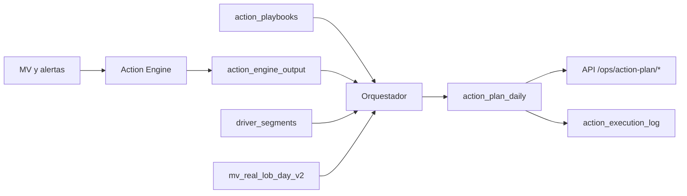

# Action Orchestrator — Fase 8 (planes operativos ejecutables)

## Resumen ejecutivo

La fase 8 añade una **capa de orquestación** que **no sustituye** al Action Engine: lee `ops.action_engine_output`, enriquece con **playbooks** (cómo ejecutar), **segmentos de conductores** (a quién) y métricas de **volumen/revenue** por ciudad para producir **`ops.action_plan_daily`** — filas priorizadas listas para que un equipo humano ejecute. El tracking sigue en **`ops.action_execution_log`**, ampliado para referenciar filas del plan.

## Flujo completo



1. **Cron / manual**: `run_action_engine` → persiste acciones en `ops.action_engine_output`.
2. **Cron / manual**: `run_action_orchestrator` → borra y recrea filas del día en `ops.action_plan_daily`.
3. **Operación**: consume `GET /ops/action-plan/today` (y variantes), ejecuta en campo, registra avance con `POST /ops/action-plan/log`.

## Cómo se genera el plan

1. **Entrada**: todas las filas de `ops.action_engine_output` con `run_date = plan_date`.
2. **Catálogo**: join a `ops.action_catalog` (solo `is_active`) para `action_type` e impacto esperado por defecto.
3. **Playbook**: `LEFT JOIN LATERAL` a `ops.action_playbooks` por `action_id` (primer `playbook_id` ordenado).
4. **Segmentos**: agregación desde la vista `ops.driver_segments` en el grano ciudad o ciudad+park según la fila del engine.
5. **Volumen sugerido**: función segura en Python que interpreta `default_volume_formula` sembrada (sin `eval` libre).
6. **Prioridad final**: refina `priority_score` del engine con severidad, viajes 7d, revenue 7d y tamaño de ciudad (log-normalizado).
7. **Dedup**: una fila por `(plan_date, action_id, country, city, park_id)` vía índice único; la regeneración diaria hace `DELETE` previo por fecha.

## Cómo se usa

- **Generar motor**: `POST /ops/action-engine/run` o `python -m scripts.run_action_engine`.
- **Generar plan**: `POST /ops/action-plan/run` o `python -m scripts.run_action_orchestrator`.
- **Leer**: `GET /ops/action-plan/today`, `GET /ops/action-plan/top`, `GET /ops/action-plan?city=lima`.
- **Tracking**: `POST /ops/action-plan/log?action_plan_id=&action_id=&owner=&status=` (misma tabla `action_execution_log` que el engine, con `action_plan_id` en lugar de `action_output_id`).

## Tabla `ops.action_plan_daily`

| Campo | Significado |
|--------|-------------|
| `plan_date` | Día del plan (alineado con `run_date` del engine). |
| `country`, `city`, `park_id` | Ámbito geográfico (puede ser null en alertas globales). |
| `action_id`, `action_name`, `action_type` | Acción y tipo operativo (del catálogo). |
| `severity` | Gravedad heredada del engine. |
| `priority_score` | Puntuación **refinada** para ordenar ejecución. |
| `suggested_volume` | Magnitud orientativa (conductores, casos, etc.) según fórmula + segmentos. |
| `target_segment` | Segmento de foco (`inactive_7d`, `active`, `low_productivity`, …). |
| `suggested_playbook_id` | Id del playbook aplicado (si existe). |
| `suggested_playbook_text` | Pasos de ejecución (texto operativo). |
| `expected_impact` | Resultado esperado (playbook o catálogo). |
| `status` | `ready` al generar; editable a `pending`, `in_progress`, `done`, `ignored`. |
| `source` | Siempre `action_engine` en esta fase. |
| `engine_reason`, `engine_output_id` | Trazabilidad al output del motor. |
| `created_at`, `updated_at` | Auditoría temporal. |

## Playbooks (`ops.action_playbooks`)

Playbooks **concretos** (ejemplos de `execution_steps`):

- **Reactivación**: lista `inactive_7d` → contacto 1:1 → incentivo → seguimiento 48h.
- **Reclutamiento**: funnel → meta diaria de leads → onboarding mismo día → revisión 72h.
- **Productividad**: taller + checklist + seguimiento a los más bajos.
- **Cancelaciones**: top motivos → dispatch/ops → SLA espera → monitor 5 días.
- **Pricing**: snapshot tarifas → benchmark → simulación → decisión acotada → vigilar 7d.
- **Data quality** (varias acciones): ticket → cuarentena/reproceso → validación muestral → cierre con métrica en verde.

Cada fila es `(playbook_id, action_id)` PK compuesta; varias acciones de calidad comparten el mismo `playbook_id` `PB_DATA_QUALITY` con pasos adaptados al `action_id`.

## Vista `ops.driver_segments`

- **Fuente**: `ops.v_real_driver_segment_trips` (completados, ventana 120d para el cálculo).
- **Park**: parque dominante por conductor en últimos 30 días (máximo de viajes).
- **Segmentos**: `high_performer` / `low_productivity` (percentiles 80/25 de `trips_7d` por ciudad), `active`, `inactive_7d` (sin viajes 7d pero sí en 30d), `inactive_30d` (sin 30d, sí en 90d), `dormant`.
- **Cruce**: `country`, `city`, `park_id`, `as_of_date`.

## Ejemplo de salida API (`GET /ops/action-plan/today`)

Ilustrativo (valores dependen de datos reales):

```json
{
  "date": "2026-04-02",
  "plans": [
    {
      "id": 12,
      "country": "pe",
      "city": "lima",
      "park_id": null,
      "action_id": "DRIVER_REACTIVATION",
      "action": "Reactivar conductores inactivos",
      "volume": 150,
      "target_segment": "inactive_7d",
      "priority_score": 184.5,
      "severity": "high",
      "steps": "Extraer lista drivers inactive_7d por ciudad/park → ...",
      "expected_impact": "Subir base activa y completados en la ciudad.",
      "status": "ready",
      "playbook_id": "PB_DRIVER_REACTIVATION"
    }
  ],
  "total": 1
}
```

## Endpoints

| Método | Ruta | Descripción |
|--------|------|-------------|
| GET | `/ops/action-plan/today` | Plan de hoy, prioridad DESC. |
| GET | `/ops/action-plan/top?limit=&plan_date=` | Top N del día (o fecha ISO). |
| GET | `/ops/action-plan?city=&plan_date=&limit=&offset=` | Filtro por ciudad. |
| POST | `/ops/action-plan/run` | Regenera `action_plan_daily` para hoy. |
| POST | `/ops/action-plan/log` | Inserta fila de tracking ligada a `action_plan_id`. |

Los endpoints **`/ops/action-engine/*`** existentes no cambian de contrato.

## Tracking (`ops.action_execution_log`)

- **Motor**: `action_output_id` + `action_id` (como antes).
- **Plan**: `action_plan_id` + `action_id` (nuevo; `action_output_id` NULL).
- Restricción `chk_action_exec_one_target`: exactamente uno de los dos FKs.
- Campos: `execution_date`, `owner`, `status`, `notes`, `updated_at` (trigger en `UPDATE`).

## Archivos tocados

- `backend/alembic/versions/124_action_orchestrator_phase8.py` — DDL, seeds de playbooks, vista, alter log.
- `backend/app/services/action_orchestrator_service.py` — lógica de orquestación y lectura.
- `backend/app/routers/ops.py` — rutas `/ops/action-plan/*`.
- `backend/scripts/run_action_orchestrator.py` — CLI.
- `docs/ACTION_ORCHESTRATOR_PHASE8.md` — este documento.

## GO / NO-GO

| Criterio | Estado |
|----------|--------|
| No duplica reglas del Action Engine | GO — solo consume output. |
| Planes concretos (qué, cuánto, a quién, prioridad) | GO |
| Auditable (engine_reason, engine_output_id, log) | GO |
| Sin ejecución externa automática | GO |
| Migración aplicable en entornos con `v_real_driver_segment_trips` | GO si existe migración 106+ |

**NO-GO** si la migración 124 no se ha aplicado o la vista base `ops.v_real_driver_segment_trips` no existe (fallará la creación de `ops.driver_segments`).

## Siguiente paso sugerido

- Programar **cron** diario: `run_action_engine` → `run_action_orchestrator`.
- Opcional: exponer `PATCH` para `status` en `action_plan_daily` o vistas de lectura del `action_execution_log` por `action_plan_id`.
